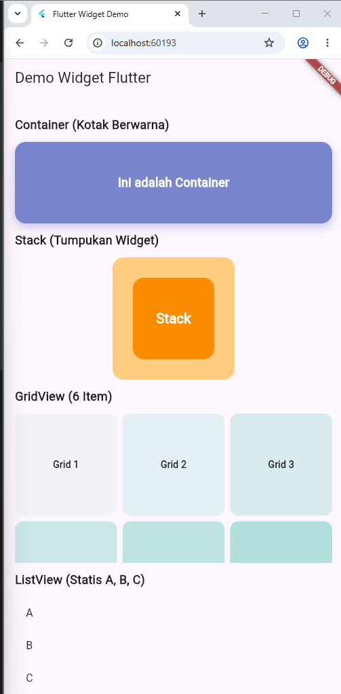
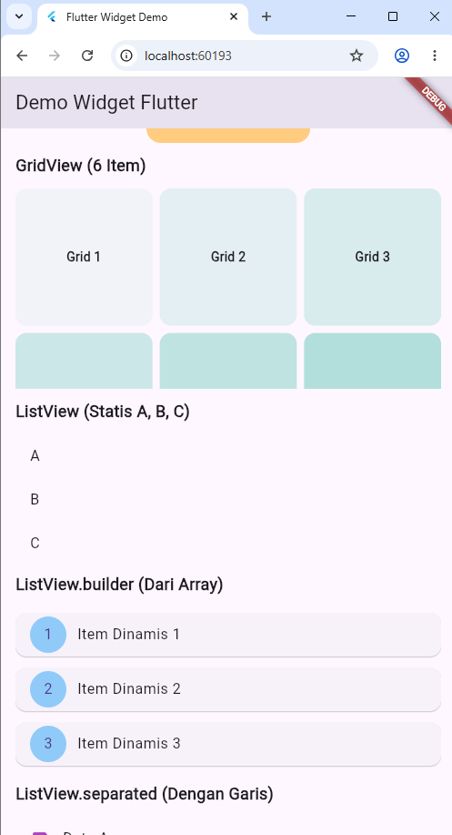

# praktikum_flutter

Demo aplikasi Flutter yang menampilkan beberapa widget UI dasar.

## Widget yang Ditampilkan

- `Container`
  - Kotak berwarna yang dapat memiliki ukuran, border radius, dan dekorasi.
- `GridView`
  - Menampilkan item dalam bentuk grid. Contoh ini menggunakan 6 item.
- `ListView`
  - Daftar vertikal statis dengan 3 item: A, B, dan C.
- `ListView.builder`
  - Membuat daftar dari data array secara dinamis saat dibutuhkan.
- `ListView.separated`
  - Daftar dengan garis pembatas antar item.
- `Stack`
  - Menumpuk widget satu sama lain untuk membuat tampilan berlapis.

## Contoh Tampilan

Tangkapan layar aplikasi ditampilkan di bawah ini:





## Cara Menjalankan

1. Pastikan Flutter sudah terpasang.
2. Buka folder proyek ini.
3. Jalankan perintah:

```bash
flutter run
```

## Penjelasan Singkat Setiap Widget

- `Container` adalah widget dasar untuk membuat kotak yang bisa diberi warna, ukuran, dan dekorasi.
- `GridView` cocok digunakan ketika ingin menampilkan sejumlah item dalam kolom dan baris.
- `ListView` berguna untuk menampilkan daftar widget secara vertikal.
- `ListView.builder` efisien untuk membuat daftar panjang karena hanya membangun item yang terlihat.
- `ListView.separated` memungkinkan menambah pemisah antar item, seperti garis atau jarak.
- `Stack` digunakan untuk menumpuk beberapa widget sehingga bisa berada di atas atau di bawah widget lain.
